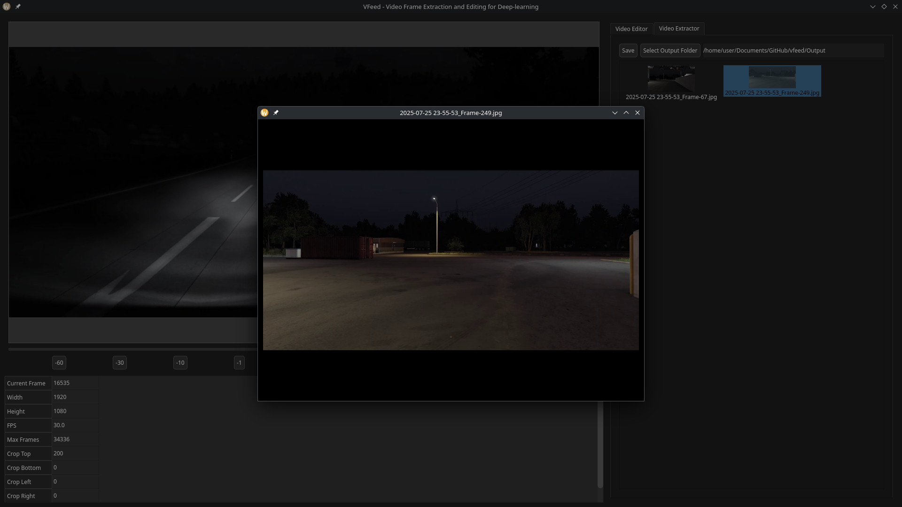
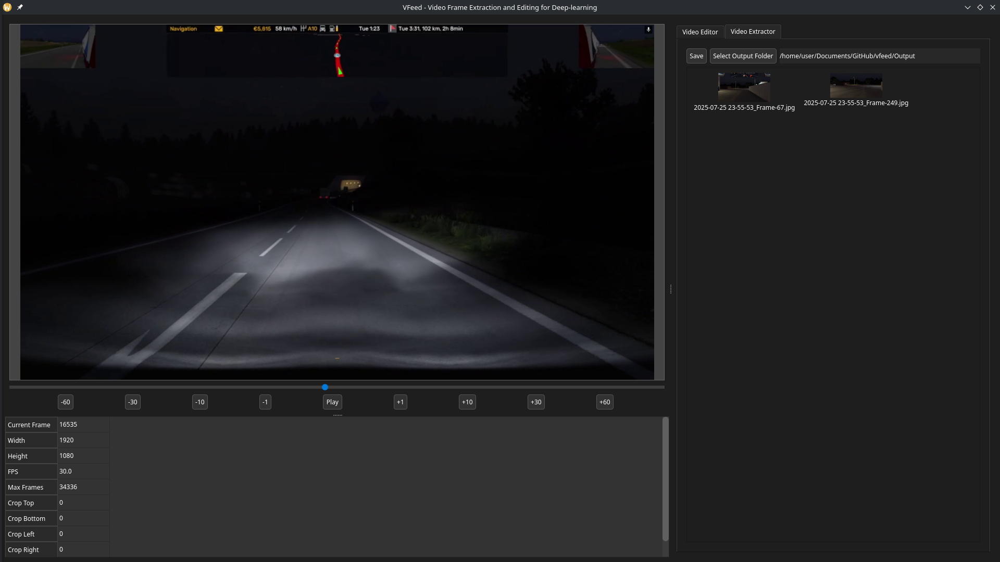
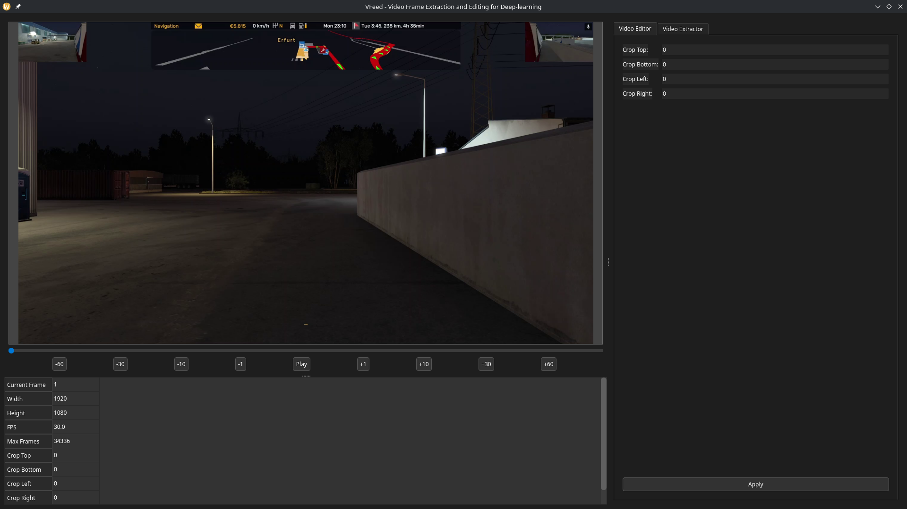

# 📽️ vfeed

**V-FEED: Video Frame Extraction and Editing for Deep Learning**

---

## ✨ Overview

**vfeed** is a simple but powerful tool to:

* 📸 **Extract frames** from video files
* 🏷️ (Coming soon) **Annotate** extracted images
* 🛠️ (Coming soon) **Edit** images for preprocessing

It's designed to help create datasets for:

* 🤖 Machine Learning
* 🧠 Deep Learning
* 📊 Any task where image data is valuable

---

## 🛠️ Features

* ▶️ Play video inside the UI
* 📁 Copy video to your working directory
* 🖼️ Extract images from selected frames

---

## 📷 Screenshots







---

## 🧪 Tech Stack

* 🐍 **Python 3**
* 🎨 **PySide6** – for GUI
* 🎥 **OpenCV** – for video processing

---

## 📦 Installation

```bash
git clone https://github.com/yourusername/vfeed.git
cd vfeed
pip install -r requirements.txt
```

---

## 🚀 Usage

```bash
python main.py
```

> Requires a video file as input — GUI will guide you from there!

---

## 💡 Why This Exists
I'm actively using this tool myself — features are added when needed and bugs are fixed as I find them.
Got a request or idea? Open an issue or pull request!

---

## 🤝 Feedback

I'm not primarily a GUI or app developer, so **feedback and suggestions are very welcome**.

---

## 📬 Contact

* ✉️ Open an issue or discussion on GitHub
* 🧠 Tips or feature ideas? Don’t hesitate to share!
